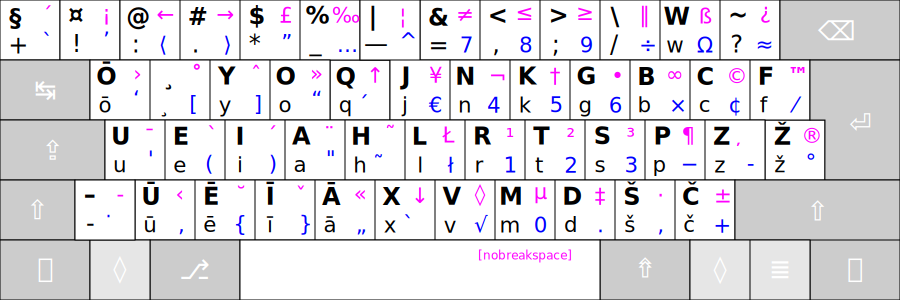
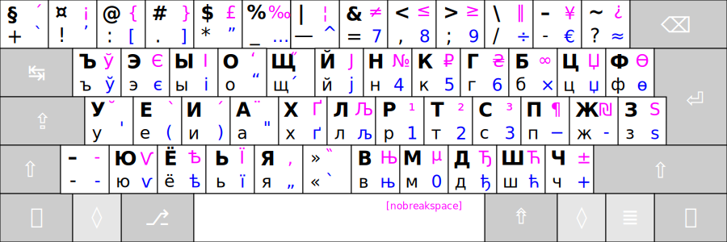

# RATISĖS PAPILDOMIEJI KITAKALBIAI IŠDĖSTYMAI

--------------------------------------------------------------------

## RATISĖS LATVIŠKAS IŠDĖSTYMAS

Tai yra papildomas Ratisės išdėstymas, kuriame latviškos raidės išdėstytos vietoje lietuviškųjų pagal garso ar kitą panašumą.
Ratisės latviškasis išdėstymas leidžia patogiai rinkti tekstus latvių kalba bei latgalių tarme.

## RATISĖS KIRILICA IŠDĖSTYMAS

Tai yra papildomas Ratisės išdėstymas, kuriame kirilicos raidės išdėstytos vietoje lietuviškųjų pagal garso ar kitą panašumą.
Ratisės Kirilica išdėstymas leidžia rinkti tekstus rusų bei kitomis kirilicą vartojančiomis kalbomis.

-------------------------
[Į pradžią](../README.md)

